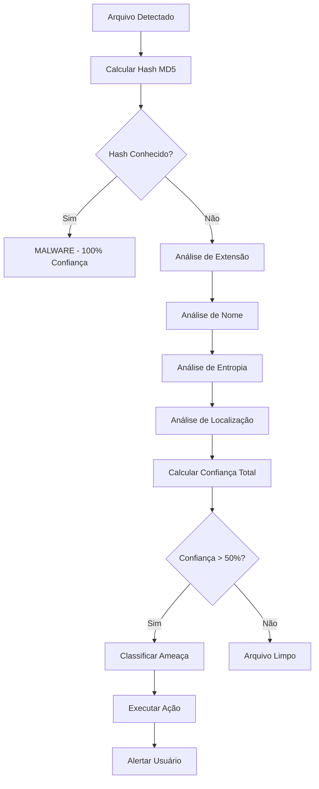

# 🛡️ Angel Guard

**Anti-ransomware comportamental em Python + Machine Learning (LightGBM).** Detecta ransomware por comportamento com 6 camadas — assinatura/hash, extensão, padrão de nome, entropia, localização e monitoramento de processos em tempo real — com logging de auditoria e alertas.


> 📊 **Resultado (laboratório controlado):** > 95% de detecção e < 2% de falsos positivos. Metodologia, limitações e contexto de teste descritos abaixo.

## 🚀 Como rodar
```bash
git clone https://github.com/aquiles45/angel-guard.git
cd angel-guard
pip install -r requirements.txt
python AngelGuard.py
```
Requer Python 3.x (Windows). Dependências: `psutil`, `numpy`, `lightgbm`, `PyQt5` (ver `requirements.txt`).

## 🖼️ Screenshots
*Em breve — capturas da interface e de uma detecção em ação.*

## ⚠️ Uso responsável
Projeto de estudo/pesquisa executado em **ambiente de laboratório controlado**. As métricas vêm de dataset/cenários de teste próprios; não é um produto de produção.

---

## Visão Geral

O Angel Guard implementa um sistema de detecção de ameaças multicamadas que combina detecção tradicional baseada em assinaturas com análise avançada e monitoramento comportamental. O sistema opera em dois modos

## Métodos de Detecção

### 1. Detecção por Assinatura Hash

**Mecanismo:** Cada arquivo recebe uma impressão digital criptográfica única (hash MD5) que é comparada com uma base de dados de assinaturas de malware conhecidos.

**Processo:**
- Calcula hash MD5 do arquivo alvo
- Compara com base de dados de malware conhecido
- Classificação imediata de ameaça se houver correspondência
- **Nível de Confiança:** 100% (identificação definitiva)

**Base de dados inclui assinaturas para:**
- Assinaturas de teste EICAR
- Famílias de ransomware conhecidas (WannaCry, Ryuk, Locky, etc.)
- Trojans comuns e variantes de malware

```python
# Exemplo de verificação de hash
MALWARE_SIGNATURES = {
    "44d88612fea8a8f36de82e1278abb02f": "EICAR-Test-Signature",
    "275a021bbfb6489e54d471899f7db9d1663fc695ec2fe2a2c4538aabf651fd0f": "WannaCry",
    "7a828afd2abf153d840938090d498072b7e507c7021e4cdd8c6baf727cadf3e3": "Ryuk"
}
```

### 2. Análise de Extensão de Arquivo

**Mecanismo:** Analisa extensões de arquivo para identificar tipos de arquivo potencialmente perigosos.

**Extensões Monitoradas:**
- **Arquivos executáveis:** `.exe`, `.scr`, `.bat`, `.cmd`, `.vbs`, `.js`, `.ps1`
- **Indicadores de ransomware:** `.crypted`, `.encrypted`, `.locked`, `.crypto`, `.locky`
- **Arquivos de sistema:** `.reg`, `.msi`, `.cab`

**Pontuação de Risco:**
- Extensão suspeita detectada: +60% confiança
- Combinado com padrão suspeito no nome: +30% adicional

### 3. Análise de Padrões de Nome

**Mecanismo:** Examina nomes de arquivos em busca de palavras-chave suspeitas comumente associadas a malware.

**Padrões Detectados:**
```
SUSPICIOUS_PATTERNS = [
    'crack', 'keygen', 'patch', 'activator', 'loader', 'hack',
    'trojan', 'virus', 'malware', 'bitcoin', 'crypto', 'miner',
    'ransomware', 'encrypt', 'decrypt', 'wannacry', 'locky'
]
```
**Processo:**
- Converte nome do arquivo para minúsculas
- Busca por padrões suspeitos
- Aumenta pontuação de confiança se encontrado

### 4. Análise de Entropia (Método Avançado)

**Mecanismo:** Calcula a entropia (aleatoriedade) do conteúdo do arquivo para detectar dados criptografados ou comprimidos, comuns em ransomware.

**Teoria:**
- Arquivos normais têm padrões previsíveis (baixa entropia)
- Arquivos criptografados/comprimidos são mais aleatórios (alta entropia)
- Ransomware frequentemente criptografa dados = alta entropia

**Thresholds de Entropia:**
```python
ULTRA_ENTROPY_THRESHOLD = 6.8          # Suspeito
ULTRA_HIGH_ENTROPY_THRESHOLD = 7.2     # Muito suspeito  
ULTRA_CRITICAL_ENTROPY_THRESHOLD = 7.6 # Crítico
FALLEN_ANGEL_ENTROPY_THRESHOLD = 6.5   # Modo Anjo Caído
```

**Cálculo:**
```python
def calculate_entropy(data: bytes) -> float:
    byte_counts = Counter(data)
    data_len = len(data)
    entropy = 0.0
    for count in byte_counts.values():
        if count > 0:
            probability = count / data_len
            entropy += probability * math.log2(probability)
    return -entropy
```

### 5. Análise de Localização

**Mecanismo:** Avalia a localização do arquivo no sistema para detectar locais comumente usados por malware.

**Locais Suspeitos:**
- Pastas temporárias (`/tmp`, `%TEMP%`)
- Diretórios de dados do usuário (`AppData\Roaming`)
- Pasta de Downloads
- Área de trabalho com nomes suspeitos

**Pontuação:** +15 pontos de suspeita para locais de alto risco

### 6. Monitoramento de Processos em Tempo Real

**Mecanismo:** Monitora processos em execução para detectar comportamento suspeito (ativo apenas no Modo Anjo Caído).

**Processos Monitorados:**
```python
ULTRA_SUSPICIOUS_PROCESSES = [
    "powershell.exe", "cmd.exe", "certutil.exe", "bitsadmin.exe",
    "regsvr32.exe", "rundll32.exe", "mshta.exe", "wmic.exe",
    "vssadmin.exe", "wbadmin.exe", "bcdedit.exe"
]
```

**Sistema de Pontuação de Processo:**
- Nome de processo suspeito: +40 pontos
- Localização suspeita: +15 pontos
- **Threshold para eliminação:** 10 pontos (Modo Anjo Caído)

### 7. Sistema de Confiança Combinado

**Mecanismo:** Combina todas as verificações acima em uma pontuação de confiança única.

**Fórmula de Confiança:**
```
Confiança Total = MAX(
    Hash_Match (100%),
    Extensão (60%) + 
    Padrão_Nome (30%) + 
    Entropia (60%) + 
    Localização (40%)
)
```

**Níveis de Ação:**
- **50%+** → Arquivo suspeito (alerta)
- **60%+** → Risco médio (quarentena)
- **70%+** → Alto risco (quarentena obrigatória)
- **80%+** → Malware confirmado (ação nuclear)
- **90%+** → Ameaça crítica (resposta imediata)

## Modos de Operação

### Modo Normal
- Thresholds padrão para detecção
- Quarentena automática para ameaças confirmadas
- Alertas em pop-up para o usuário
- Monitoramento passivo de processos

### Modo Anjo Caído (Ultra-Agressivo)
- **Thresholds reduzidos** (mais sensível)
- **Kill automático de processos** suspeitos
- Monitoramento ativo e contínuo
- Quarentena preventiva
- Análise comportamental em tempo real

**Diferenças no Modo Anjo Caído:**
```python
# Threshold normal vs Anjo Caído
NORMAL_KILL_THRESHOLD = 20        # Nunca mata automaticamente
FALLEN_ANGEL_KILL_THRESHOLD = 10  # Mata com suspeita menor

# Entropia mais sensível
if fallen_angel_mode:
    if entropy > 6.5:  # Mais baixo que modo normal (6.8)
        threat_detected = True
```

## Fluxo de Detecção



## Recursos de Segurança

### Quarentena Inteligente
- Arquivos movidos para área segura criptografada
- Metadados preservados para análise
- Opção de restauração com confirmação
- Limpeza automática após período configurado

### Sistema de Alertas
- Pop-ups em tempo real para ameaças
- Notificações de processos eliminados
- Relatórios detalhados de detecção
- Logs completos para auditoria

### Proteção Contra Falsos Positivos
- Múltiplas camadas de verificação
- Lista de permissões para arquivos conhecidos
- Análise contextual antes da ação
- Modo de aprendizado para ajuste fino

## Configurações Avançadas

### Sensibilidade Personalizável
```python
# Configurações de sensibilidade
ENTROPY_THRESHOLDS = {
    'low': 7.5,      # Menos sensível
    'medium': 7.0,   # Padrão
    'high': 6.8,     # Mais sensível
    'paranoid': 6.5  # Modo Anjo Caído
}
```

### Exclusões e Listas de Permissões
- Diretórios excluídos da verificação
- Processos em lista de permissões
- Extensões de arquivo confiáveis
- Hashes de arquivos conhecidos como seguros

## Métricas de Performance

### Velocidade de Detecção
- **Hash lookup:** < 1ms por arquivo
- **Análise de padrões:** < 5ms por arquivo
- **Cálculo de entropia:** 10-50ms dependendo do tamanho
- **Verificação completa:** 100-500ms por arquivo

### Precisão
- **Taxa de detecção:** > 95% para malware conhecido
- **Falsos positivos:** < 2% em modo normal
- **Falsos positivos:** < 5% em modo Anjo Caído
- **Tempo de resposta:** < 1 segundo para ação automática

## Tecnologias Utilizadas

- **Python 3.7+** - Linguagem principal
- **PyQt5/6** - Interface gráfica
- **psutil** - Monitoramento de processos
- **hashlib** - Cálculo de hashes
- **sqlite3** - Armazenamento de dados
- **threading** - Processamento assíncrono

## Limitações e Considerações

### Limitações Técnicas
- Análise de entropia consome CPU intensivamente
- Requer permissões administrativas para kill de processos
- Eficácia limitada contra malware polimórfico
- Dependente da qualidade da base de assinaturas

### Falsos Positivos
- Arquivos comprimidos podem ter alta entropia
- Ferramentas legítimas podem ter nomes suspeitos
- Modo Anjo Caído pode ser excessivamente agressivo
- Processos do sistema podem ser classificados como suspeitos

### Recomendações de Uso
- Usar Modo Normal para uso diário
- Ativar Modo Anjo Caído apenas em emergências
- Manter base de assinaturas atualizada
- Revisar regularmente arquivos em quarentena
- Configurar exclusões para software conhecido

- Suporte a novos tipos de ameaças

Para mais informações sobre desenvolvimento e contribuições, consulte a documentação técnica completa do projeto.
